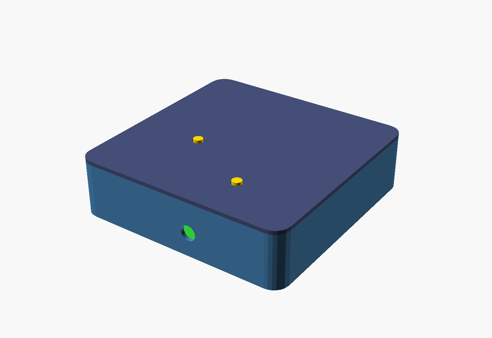
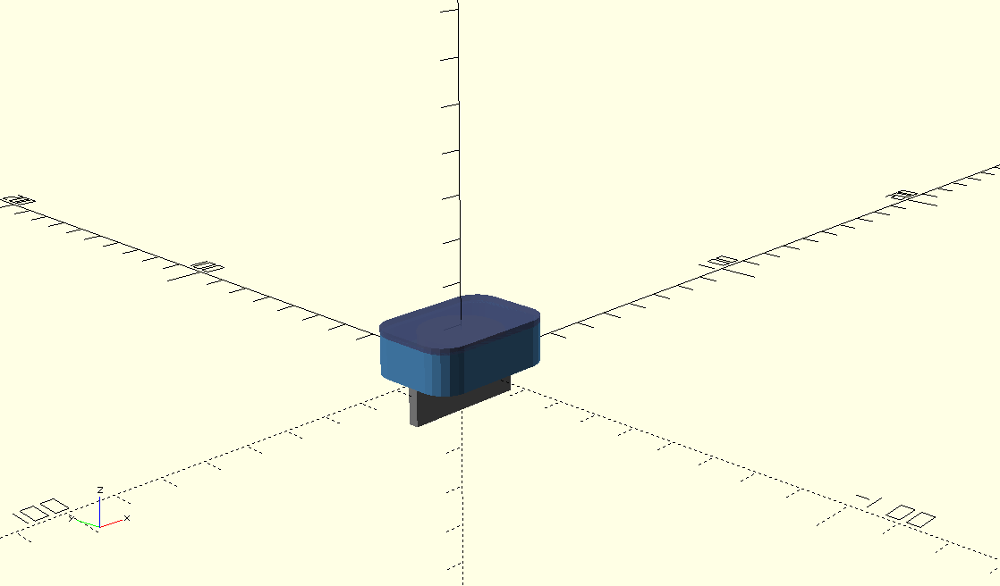

# Draft isian — LAPORAN KEMAJUAN Pekan 4 Group 13

Tinggal copy-paste ke bagian yang kosong di file .docx. Yang ditandai
`[PILIH SALAH SATU]` perlu diputuskan tim dulu sebelum dipaste.

## Checklist — semua yang harus diisi

- [ ] Section 3: centang checkbox No 3 & 4 jadi "Belum"
- [ ] Section 5: update tugas Calvin (tambahan validasi dimensi via OpenSCAD)
- [ ] Section 4: isi kolom "Penanggung Jawab" di 4 baris (kosong semua)
- [ ] Section 4: isi kolom "Hasil" baris 2 (3D model) & baris 3 (mockup dashboard)
- [ ] Section 6: isi "Status integrasi" (Hardware)
- [ ] Section 6: ganti "..." di Software (Fitur selesai & masih dikembangkan)
- [ ] Section 6: ganti "..." di Mekanik/Biomedik + putuskan angka 18mm vs 23mm
- [ ] Section 7: tambah Gambar 7 & 8 (render OpenSCAD Vest Node & Helmet Node) — lihat di bawah
- [ ] Section 8: isi tabel pengujian (simulasi/verifikasi dimensi) + Analisis Singkat
- [ ] Section 9: isi 3 baris Kendala dan Solusi (kosong total)
- [ ] Section 2: tambah kalimat soal validasi dimensi ke ringkasan (opsional tapi disaranin)
- [ ] Section 11: perjelas task Yoga (revisi dimensi spesifik apa)
- [ ] Section 12: pertimbangkan naikin persentase "Pengujian" (masih 0%, padahal Section 8 sekarang ada isinya)
- [ ] Section 13: tambah kalimat soal temuan validasi ke kesimpulan (opsional tapi disaranin)

---

## 3. Target Pekan Ini — centang checkbox

- No 3 "Perancangan mockup dashboard awal": **☑ Belum** (baru tahap persiapan/referensi, belum jadi mockup)
- No 4 "Order semua komponen lewat e-commerce": **☑ Belum** (baru 80%, sebagian belum sampai)

---

## 4. Realisasi Kegiatan

**Baris 1 — PCB Design**
- Penanggung Jawab: `Gibran, Rifat`

**Baris 2 — 3D model**
- Penanggung Jawab: `Yoga`
- Hasil: `Draft 3D casing P.A.N.D.U selesai dibuat menggunakan Autodesk Fusion 360 (Gambar 1). Blueprint 2D presisi dengan dimensi 55 x 65 x 18 mm telah disusun sebagai acuan tata letak komponen pada PCB (Gambar 2).`

**Baris 3 — Perancangan mockup dashboard**
- Penanggung Jawab: `Rafif, Calvin`
- Hasil: `Persiapan perancangan mockup dashboard sesuai layout device yang akan ditentukan. Belum masuk tahap desain visual final karena masih menunggu layout device dikunci.`

**Baris 4 — Order komponen lewat e-commerce**
- Penanggung Jawab: `Rafif`

---

## 2. Ringkasan Kemajuan Pekanan — tambahan (opsional)

Tambahkan 1 kalimat di akhir paragraf yang sudah ada:
`Validasi dimensi casing terhadap komponen elektronik juga dilakukan menggunakan simulasi parametrik (OpenSCAD), yang menemukan perlunya revisi ukuran casing sebelum masuk tahap cetak 3D.`

---

## 5. Kemajuan Tiap Anggota — update baris Calvin

Tugas Pekan Ini (tambahkan ke isi yang sudah ada, jangan diganti):
`Melakukan persiapan perancangan mockup dashboard sesuai layout device yang nanti ditentukan.`
`Melakukan validasi dimensi casing Vest Node Master & Helmet Node menggunakan model parametrik (OpenSCAD) untuk memastikan komponen elektronik (baterai, PCB, modul LoRa/GPS, ESP32-C3) muat sesuai rancangan sebelum masuk tahap cetak 3D.`

Persentase Penyelesaian: `100%` (tetap, dua-duanya sudah selesai dikerjakan)

---

## 6. Hasil Implementasi

**Hardware — Status integrasi:**
`Belum ada integrasi fisik antar unit. Ketiga PCB (Vest Node Master, Helmet Node, Edge Gateway) masih dalam tahap desain layout di EasyEDA Pro, belum masuk tahap fabrikasi/assembly.`

**Software — Fitur yang telah selesai:**
`Belum ada fitur software yang selesai pada pekan ini.`

**Software — Fitur yang masih dikembangkan:**
`Mockup dashboard (baru tahap persiapan referensi desain). Firmware embedded dan backend belum dimulai, menunggu PCB dan komponen selesai.`

**Mekanik/Biomedik:**
`Draft 3D casing P.A.N.D.U selesai dibuat di Autodesk Fusion 360 (Gambar 1).`
`Blueprint 2D presisi dengan dimensi 55 x 65 x [PILIH SALAH SATU: 18 / 23] mm telah disusun sebagai acuan tata letak komponen PCB (Gambar 2).`

> Catatan buat tim (hapus sebelum submit): dimensi tebal (depth) casing
> awalnya 18mm, tapi hasil validasi ulang terhadap baterai 18650 (Ø18mm)
> menunjukkan 18mm nggak cukup setelah dikurangi dinding cetak 3D —
> direvisi jadi 23mm. Kalau laporan ini mau tetap pakai 18mm (angka asli
> Yoga), berarti masih perlu dikoordinasikan revisinya ke pekan depan.
> Kalau mau langsung pakai angka yang udah divalidasi, ganti ke 23mm.

---

## 8. Pengujian yang Dilakukan

> Ini bukan pengujian fisik (belum ada hardware jadi), tapi pengujian
> simulasi/verifikasi desain -- tetap valid dimasukkan ke tabel ini.

| Parameter | Target | Hasil | Status |
|---|---|---|---|
| Kesesuaian dimensi internal casing Vest Node vs komponen elektronik (baterai 18650, ESP32-WROOM-32, modul LoRa SX1276, GPS NEO-6M) | Seluruh komponen muat di dalam casing tanpa overlap/tabrakan | Ketebalan awal 18mm tidak cukup (baterai overlap 2mm); setelah direvisi ke 23mm dan divalidasi ulang lewat simulasi parametrik (OpenSCAD), seluruh komponen tervalidasi muat | Lulus (setelah revisi) |

**Analisis Singkat:**
`Verifikasi dimensi dilakukan secara simulasi menggunakan model parametrik (OpenSCAD) sebelum casing masuk tahap cetak 3D. Ditemukan bahwa ketebalan awal 18mm tidak mengakomodasi baterai 18650 (diameter 18mm) setelah diperhitungkan dengan tebal dinding cetak. Revisi ketebalan menjadi 23mm, serta revisi tinggi casing dari 65mm menjadi 70mm untuk mengakomodasi panjang baterai (65mm) beserta dinding di kedua ujungnya. Hasil render 3D (Gambar 7, Gambar 8) dan pengecekan otomatis pada model mengonfirmasi seluruh komponen tervalidasi muat setelah revisi.`

**Dokumentasi pendukung:** lihat Gambar 7 & 8 di Section 7 (sudah direferensikan di Analisis Singkat sebagai "Gambar 7, 8").

---

## 7. Dokumentasi Hasil — tambahan gambar

Tambahkan di bagian "Lainnya" (setelah Gambar 6), lanjutan penomoran:

Gambar 7. Hasil simulasi render 3D casing Vest Node Master untuk validasi kesesuaian dimensi internal komponen (baterai 18650, PCB, modul LoRa/GPS) menggunakan OpenSCAD.

Gambar 8. Hasil simulasi render 3D casing Helmet Node untuk validasi kesesuaian dimensi internal komponen (ESP32-C3 SuperMini, CR2032, tab mounting Euroslot) menggunakan OpenSCAD.

> Catatan: re-export dulu kedua PNG ini setelah render ulang model (ada
> revisi case_h Vest Node 65mm -> 70mm), biar gambar yang masuk laporan
> nunjukkin hasil yang udah bener, bukan yang masih ada baterai nongol.

---

## 11. Rencana Kerja Pekan Berikutnya — perjelas baris Yoga

Ganti "Finalisasi Desain 3D Casing" jadi lebih spesifik:
`Finalisasi Desain 3D Casing (termasuk revisi dimensi hasil validasi: tebal 18mm->23mm, tinggi 65mm->70mm)`

---

## 12. Persentase Progress Proyek — pertimbangkan

Baris "Pengujian" masih 0%, tapi Section 8 sekarang ada isi (pengujian
simulasi dimensi). Diskusikan sama tim: naikkan jadi `5%` (baru mulai,
masih simulasi bukan fisik) atau tetap `0%` kalau tim mau "Pengujian"
cuma dihitung pas ada hardware fisik. Kalau naik ke 5%:
`Progress Total = 27,25% + (15% x 5%) = 28%`

---

## 13. Kesimpulan — tambahan (opsional)

Tambahkan 1 kalimat di akhir paragraf yang sudah ada:
`Validasi dimensi casing menggunakan simulasi parametrik turut dilakukan pekan ini, menemukan kebutuhan revisi ukuran (ketebalan dan tinggi) sebelum desain 3D dikunci final oleh Yoga.`

---

## 9. Kendala dan Solusi

| Kendala | Dampak | Solusi yang Dilakukan |
|---|---|---|
| Routing jalur kelistrikan PCB Edge Gateway (Unit 3) belum selesai | PCB Edge Gateway belum bisa difinalisasi & ikut masuk antrian order bareng 2 unit lain | Melanjutkan routing di pekan berikutnya, diprioritaskan Gibran/Rifat sebelum target order PCB 26 September 2026 |
| Sebagian komponen yang dipesan lewat e-commerce belum sampai | Menghambat rencana perakitan & pengujian komponen individual di pekan berikutnya | Memantau status pengiriman secara berkala; siapkan alternatif vendor kalau keterlambatan signifikan |
| Dimensi awal blueprint casing (55x65x18mm) ternyata tidak cukup untuk baterai 18650 (Ø18mm) setelah diperhitungkan dengan tebal dinding cetak 3D | Yoga perlu merevisi model 3D casing di Fusion 360 (ketebalan 18mm -> 23mm) sebelum desain dikunci final | Ketebalan direvisi menjadi 23mm; divalidasi ulang menggunakan simulasi parametrik (OpenSCAD) untuk memastikan seluruh komponen (baterai, PCB, modul GPS/LoRa) muat sebelum fabrikasi |
